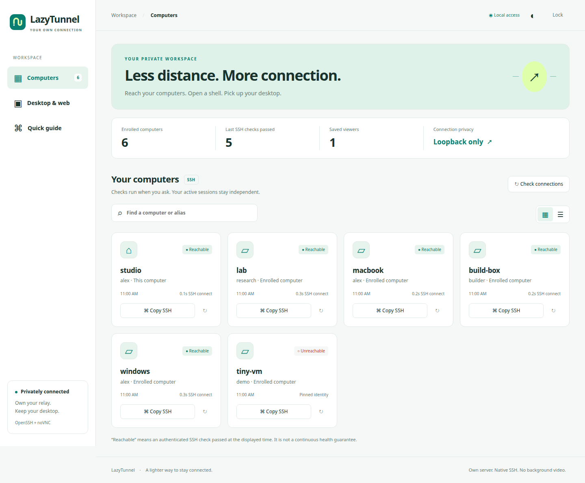

# Optional LazyTunnel console

A small, private web GUI for enrolled computers and existing noVNC services.
It uses Python's standard library, static HTML/CSS/JavaScript and the existing
OpenSSH client. There is no container, npm build, database server, telemetry,
CDN, external font, continuous SSH scan or background video stream.

The cloud relay continues to do one job: carry restricted SSH connections.
The console runs on an **enrolled client**, not on a public cloud management port.



Illustrative interface screenshot using synthetic device names and status data.

## Install and open

On an enrolled Linux client, from a reviewed checkout:

```bash
cd /path/to/LazyTunnel
python3 scripts/lazytunnel-client.py update --source .
lazytunnel gui install
lazytunnel gui code
lazytunnel gui
```

Open **http://127.0.0.1:17765** in a browser on that computer. Paste the local
access code into the unlock form. The code is not an account password. It stays
in this browser tab's session storage and is sent in an Authorization header,
never a URL. Closing the browser does not stop the console or its forwards.
Lock clears the tab's code; reloading the unlocked tab preserves it.

For this first GUI upgrade, invoke the installer from the new checkout as
shown above. Older installed CLI versions had a fixed file list that did not
include GUI assets. This version delegates subsequent updates to the reviewed
new checkout's installer so new modules are included automatically.

`install` enables `lazytunnel-gui.service` and adds **LazyTunnel** to the Linux
application menu. It is idempotent: a matching rerun keeps the running service.
It neither opens a browser at boot nor modifies the dock. Linux user lingering,
already configured by `lazytunnel boot` for an unattended fleet client, lets
the service start without a desktop login. Enabling it is not a reboot test.

```bash
lazytunnel gui status
lazytunnel gui stop
lazytunnel gui rotate-code
lazytunnel gui code
```

Stopping the console leaves its separately supervised web forwards running.
To stop a forward, use its own Stop button before stopping the console, or use
the corresponding `lazy-web stop gui-ID` command. Rotating the access code
invalidates old browser codes on the next API request without touching SSH keys.

For a temporary console, use `lazytunnel gui serve`; Ctrl+C stops only the
console. A file lock prevents a second console for the same enrolled identity,
even on another port. `--port PORT` selects a different local port, but changing
an already installed unit requires an explicit service/configuration migration.

## Computers

- The device list comes from the existing private enrollment bundle. Alias
  synonyms collapse into one card for each pinned device identity.
- Search matches the canonical name, user and aliases. Grid and list views,
  light/dark themes and phone-sized layouts are available.
- **Copy SSH** copies `ssh-lazy-NAME`. Paste it in a terminal. The GUI does not
  execute arbitrary commands or claim to be a browser terminal emulator.
- **Check connections** runs only the fixed `hostname` command through each
  pinned SSH route. Checks are explicit, limited to four concurrent probes,
  ten seconds each and one batch per fifteen seconds. Timed-out probes and
  their child proxies are terminated together.
- Results show the time of the last check and total SSH connection time, not
  network ping latency. They live in memory and reset when the console restarts.
  A green result does not guarantee a computer is still online later.

While visible, the browser refreshes local state every fifteen seconds; it
pauses when hidden. It does not keep repeating SSH probes. During an explicitly
requested check it refreshes the results every two seconds until completion.

## Desktop and web viewers

Click **Desktop & web → Add viewer**. Supply:

| Field | Example | Meaning |
| --- | --- | --- |
| Name | Lab desktop | A local label |
| Computer | alpha | The enrolled host serving the existing viewer |
| Viewer HTTP port | 6080 | noVNC/web port as seen on that host's loopback |
| Local port | 16080 | A free, unprivileged loopback port on this client |
| Path | `/vnc.html?resize=scale` | Original viewer URL path; no credentials |

Save first, then **Start**. A separately owned
`lazytunnel-web-gui-ID.service` carries the HTTP and WebSocket connection over
OpenSSH. systemd handles restart with a fifteen-second delay, independently
of the GUI. Open the viewer using its **Open viewer** button.

If a Linux host serves a Windows VM's WeChat/WeCom viewer, select the **Linux
host**, not the Windows guest. For example, use the existing HTTP service's
port with `/wechat` or `/wecom`. Use the full noVNC viewer and `resize=scale`
where supported; LazyTunnel does not resize or recreate the source desktop.

For a viewer already available locally, tick **Use an existing local viewer**.
This is a bookmark with an Open button. Multiple paths may share the same port.
The GUI has no Start/Stop ownership over that original service. Removing the
bookmark leaves its application and desktop untouched.

Managed forwards have unique local ports. An occupied port is refused;
another application's listener is never killed or adopted. Start is idempotent.
A running/enabled forward must be stopped before its saved card can be removed.
The Stop action affects only that GUI-owned forward, not the carrier, source
viewer, RDP, UU, VNC server, desktop, or other projects' forwards. Inactive
generated unit files may remain as small diagnostic artifacts after a card is
removed; they are disabled and do not reopen listeners.

**Forward active** means systemd reports the service running. It is not a claim
that the remote HTTP service or VNC desktop is healthy. The original viewer's
authentication, Origin checks and input-control lease still apply. There are no
automatic live previews that connect to or take over a desktop.

## Browser placement and other operating systems

The full service/control backend currently targets **Linux with user systemd**.
Python 3.9+ on macOS can run the foreground console, SSH checks and existing
viewer bookmarks; managed-forward buttons are disabled there. Its normal
`lazytunnel web` command remains available. A native Windows GUI backend is not
part of this release; Windows fleet SSH, carriers and PowerShell CLI are unchanged.

Any modern Windows/macOS/mobile browser can display the console through an
authenticated SSH forward. **The browser's loopback is its own computer**, so
forward both the console port and the viewer ports using matching local ports.
For a console on alpha with an existing viewer on port 6144, Windows can run:

```powershell
# Terminal 1: the console (keep this terminal open)
lazytunnel web -Device alpha -Port 17765 -LocalPort 17765
# Terminal 2: the existing viewer (keep this terminal open)
lazytunnel web -Device alpha -Port 6144 -LocalPort 6144 -Path /wecom
```

Then open `http://127.0.0.1:17765` in the Windows browser and unlock using that
console's code. Its port-6144 viewer links now work there. For other saved
viewer ports, forward those ports too. Retaining the console's original local
port is required by its strict Host/Origin checks. Do not bind the GUI to a
public or LAN interface to avoid doing the authenticated forwarding step.

Using a browser inside RDP/VNC on the console computer needs no additional
forward. A phone viewing that same remote desktop can use it normally. Direct
phone-browser access needs an authenticated SSH-forwarding client; this release
does not add a public mobile login gateway or a VPN.

## Privacy and security

- Bind only to `127.0.0.1`. No firewall/cloud changes are made by GUI installation.
- API access requires a random 256-bit code in a user-owned mode-0600 file.
  Only the static unlock page and a non-sensitive health response are public
  to local connections. No code, credentials or private bundle is returned by
  an API or committed to the repository.
- Exact Host and same-origin checks reject DNS rebinding, foreign Origin and
  cross-site requests. Mutations require bounded JSON bodies and the auth header.
- Strict CSP, no inline scripts, no third-party resources, no framing, no URL
  credentials and `noopener` viewer links isolate the console from viewer pages.
- Device/profile labels render as text, never executable HTML. Targets must
  match an enrolled identity. There is no shell API, path-to-file API, package
  installer API or general-purpose subprocess API.
- HTTP concurrency is capped at sixteen connections; socket timeouts and an
  8 KiB mutation-body limit bound the small local server's resource use.
- Control operations accept only generated profile IDs and owned service
  names. SSH retains pinned host keys, separate identities, loopback listeners
  and disabled agent/X11 forwarding.

The code authorizes control as the local enrolled user. It is not a multi-user
RBAC system. Someone with that user's filesystem access can read its code and
SSH keys already. Keep it private, and rotate it after sharing it for support.

## State, updates and recovery

| Item | Location |
| --- | --- |
| Optional GUI code | Client `current/gui/` immutable release |
| Local code and saved viewers | `~/.config/lazytunnel-fleet/gui/` |
| GUI service | `~/.config/systemd/user/lazytunnel-gui.service` |
| Independent viewer services | `~/.config/systemd/user/lazytunnel-web-gui-*.service` |
| Application launcher | `~/.local/share/applications/art.lazying.LazyTunnel.desktop` |

```bash
lazytunnel update --source /path/to/LazyTunnel
systemctl --user restart lazytunnel-gui.service
```

Only the GUI restarts. Generated viewer services execute native SSH directly,
so their running processes survive GUI updates. Code updates do not overwrite
the access code, saved viewers, SSH keys or cloud enrollment. To roll back,
restore the reviewed previous client `current` symlink and restart only the
GUI. Keep credentials/state outside release directories and version control.

## Validation

```bash
python3 -m unittest discover -s tests -v
node --check gui/app.js  # development check; Node is not a runtime dependency
git diff --check
```

The workstation acceptance run verified seven authenticated SSH checks, both
themes, grid/list/search, a 390-pixel phone layout, browser lock behavior,
existing-viewer bookmarks and an HTTP noVNC forward through a second enrolled
computer. The forward kept the same SSH PID across a GUI restart. Its temporary
test service was then stopped. Existing carrier/UU/RDP PIDs were preserved.
The console used about 13 MiB while idle in the initial observation. Startup
was enabled and inspected without rebooting; no reboot test is claimed.

The tests also cover numeric device names (for example `7090`), alias grouping,
idempotent concurrent saves, conflicting ports, URL and command injection,
unowned service protection, access-code rotation, API authorization, Host/Origin
boundaries, bounded requests and process-group cleanup on a timeout.
