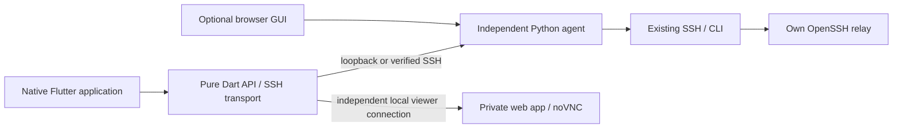

# Native LazyTunnel applications

LazyTunnel has an optional Flutter application for Ubuntu, macOS, Windows, iOS
and Android. Its management screens are real application widgets. Only a
forwarded noVNC/web page uses a mobile WebView; the application itself is not a
browser wrapper.

The native app adds a private control room to the existing SSH fleet. It does
not install a replacement desktop, take ownership of UU/RDP/VNC, or require a
VPN or a change to the default network route.

## The core is independent



| Component | Location | Responsibility |
| --- | --- | --- |
| Relay and enrollment | `fleet.py`, `scripts/fleet-*` | Restricted cloud identities, device registration, persistent SSH carriers |
| Controller and agent API | `lazytunnel_core/` | Inventory, bounded checks, saved viewer configuration; no GUI imports |
| Browser adapter | `gui/` | Static browser interface and authenticated proxy to the agent |
| Reusable native client | `packages/lazytunnel_client/` | Typed models, HTTP, verified SSH/jump transport, PTY streams and local forwards; no Flutter imports |
| Application | `apps/lazytunnel/` | Widgets, lifecycle, secure-storage adapter and platform launchers |

The Python agent remains useful without either GUI. The native transport can
also be used from a Dart CLI. Closing the browser or native app does not stop
the relay, endpoint carrier or the agent’s persistent systemd forwards.

## Start the controller

On an already enrolled Linux computer:

```bash
cd /path/to/LazyTunnel
python3 scripts/lazytunnel-client.py update --source .
lazytunnel agent install
lazytunnel agent status
lazytunnel agent code
```

The agent listens on **127.0.0.1:17766**. The optional browser console still uses
**127.0.0.1:17765** and the existing access code:

```bash
lazytunnel gui install
lazytunnel gui
```

An already running older browser console needs one `systemctl --user restart
lazytunnel-gui.service` after the independent agent is installed. This restarts
only the console. It does not restart SSH, UU, XRDP, VNC or forwarded services.

Agent service installation and persistent viewer management currently target
Linux/systemd. macOS, Windows and mobile applications can control that agent
over SSH. This is separate from the existing cross-platform fleet client, which
continues to support Linux, macOS and Windows enrollment.

## Connect from the native app

### On the controller itself

Choose **This device** and click **Connect**. On Ubuntu, the application can
read the current user’s private local access-code file. It neither logs nor
automatically exports it. If discovery is unavailable, paste the output of
`lazytunnel agent code` yourself.

### From another computer or phone

Choose **Through SSH** and enter:

1. A connection name, controller SSH hostname/IP, port and username.
2. The controller’s verified host fingerprint.
3. Your SSH password or OpenSSH private key and optional key passphrase.
4. Agent port `17766` and the access code obtained on the controller.

Verify the host fingerprint on the controller through an already trusted route:

```bash
ssh-keygen -lf /etc/ssh/ssh_host_ed25519_key.pub
```

Use the complete `SHA256:…` value. A mismatch is rejected before agent access;
the app never silently trusts a changed host key. A successful SSH connection
also requires an authorized account/key and permission to forward the agent
port. Password login need not be enabled when using keys.

For a controller reachable only through your cloud relay, expand **Use a cloud
jump host**. Supply the relay host, SSH port, its dedicated jump username and
credentials, and its separately verified host fingerprint. The controller host
then normally becomes `127.0.0.1`, and its SSH port is its reverse listener on
that relay. Use the endpoint’s fingerprint for the inner connection. Consult
your private enrollment record for these values; they are deliberately absent
from the public repository.

An SSH alias from another computer’s `~/.ssh/config` is not automatically
available on a phone. Enter its actual connection values. Keep private keys
private and use a separately enrolled identity when independent revocation is
needed. The application does not ask for the cloud administrator’s password.

**Remember in secure storage** is optional. It uses the platform secret store:
Linux Secret Service, macOS/iOS Keychain, Android Keystore-backed storage and
Windows secure storage. If it is unavailable or locked, connect for the current
visit without saving; there is no plaintext fallback. **Connections** lets you
switch profiles or forget saved credentials.

## Everyday use

- **Overview:** fleet summary and quick access. Reachability is a recorded check,
  not a continuous promise that a computer remains online.
- **Computers:** search by name/user/alias; check a computer, copy its SSH command
  or open a terminal.
- **Viewers:** save noVNC or private web-app paths, start/stop only app-owned
  managed forwards, and open an available viewer.
- **Connections:** connect/disconnect and manage saved profiles.
- The toolbar switches light/dark appearance and refreshes current state.

Through SSH, the in-app terminal opens a PTY and uses the controller’s existing
fleet SSH configuration. UTF-8 streams preserve Chinese, Japanese and other
Unicode text. The terminal has a paste button and a small mobile row for Tab,
Escape, Ctrl shortcuts and arrows. It does not rewrite the workstation’s
keyboard layout. Terminal output is bounded to 5,000 lines in the app.

On a local Ubuntu connection, **Terminal** opens the system terminal using the
existing fleet configuration. Native SSH sessions end when their tab/app is
closed; use `tmux` on the remote machine for work that must survive a disconnect.

An **existing local viewer** is a bookmark for another application’s service.
LazyTunnel does not start or stop that application. A **managed forward** is a
separate controller-owned systemd service. Stop it explicitly before removing
its saved card.

For a remote controller, the app opens a second, local-only TCP forward before
showing a viewer. Desktop systems open their normal browser. iOS/Android keep
the viewer inside the app so it remains in the foreground. The viewer permits
navigation only on its forwarded origin and does not expose a native JavaScript
bridge. noVNC’s own authentication still applies.

## Mobile lifecycle

Keep the application in the foreground while using its SSH terminal or viewer.
iOS and Android can suspend network activity when an app is backgrounded; this
is not an always-on mobile SSH daemon. On resume, the app refreshes state and
reports a lost connection rather than replaying commands or viewer mutations.
Reconnect if necessary. Controller-owned services continue independently.

The app preserves the underlying web service’s clipboard support. It does not
promise that every noVNC page or mobile WebView can access the system clipboard;
use the viewer’s clipboard panel where required. In-app SSH paste is explicit.

## Build from source

Pinned SDK: **Flutter 3.47.2 / Dart 3.13.2**. Get the appropriate official archive
and verify its checksum. Reuse an existing SDK; it does not belong in this repo.

```bash
# UI-independent library
cd packages/lazytunnel_client
dart pub get
dart analyze
dart test

# Native application (from the repository root)
FLUTTER_BIN=/path/to/flutter/bin/flutter scripts/build-native.sh linux
```

Ubuntu development dependencies include `clang`, `cmake`, `ninja-build`,
`pkg-config`, `libgtk-3-dev`, `libsecret-1-dev` and C++ standard-library headers.
Runtime dependencies include GTK3, libsecret and an available OpenGL/Mesa stack.
The downloaded release bundle includes Flutter and plugin libraries; do not
copy only its executable.

```bash
python3 scripts/install-native-linux.py \
  --bundle apps/lazytunnel/build/linux/x64/release/bundle
lazytunnel-app
```

The per-user installer provides **LazyTunnel Native** in Applications. Its
versioned installation is separate from the agent and existing browser launcher.
Running it again with the same bundle is idempotent. Previous releases remain
available; changing the installed pointer does not kill an already open window.

On Windows, use a compatible Visual Studio C++ desktop build toolchain:

```powershell
.\scripts\build-native-windows.ps1 -Flutter C:\path\to\flutter\bin\flutter.bat
```

Distribute the complete `build\windows\x64\runner\Release` directory. The per-user installer creates a Start-menu shortcut:

```powershell
.\scripts\install-native-windows.ps1 -Bundle .\apps\lazytunnel\build\windows\x64\runner\Release
```

Flutter builds require Windows symlink permission. Either enable Developer Mode
on a development machine or run the build from an elevated developer terminal.
The installed GUI itself does not require administrator privileges. Install
the Microsoft Visual C++ runtime if the target system does not have it. A
Windows ZIP without an Authenticode signature may trigger SmartScreen; do not
disable SmartScreen system-wide.

On macOS with Xcode selected:

```bash
FLUTTER_BIN=/path/to/flutter/bin/flutter scripts/build-native.sh macos
FLUTTER_BIN=/path/to/flutter/bin/flutter scripts/build-native.sh ios-simulator
FLUTTER_BIN=/path/to/flutter/bin/flutter scripts/build-native.sh ios
```

Install a verified macOS bundle with:

```bash
scripts/install-native-macos.sh apps/lazytunnel/build/macos/Build/Products/Release/LazyTunnel.app
```

The installer uses `~/Applications`, preserves one timestamped previous app on
replacement, and asks you to close an already running LazyTunnel window first.
It never disables Gatekeeper globally.

### iOS signing

The last iOS command produces an **unsigned iOS device build**, not an installable
IPA. Device installation requires a valid Apple team, signing identity and
provisioning profile; App Store/TestFlight distribution additionally requires
the corresponding distribution setup. Configure these on the signing host or
through private build settings, never commit certificates, provisioning files
or account credentials. See the release verification record for what was
actually built and signed.

For an existing development certificate and registered-device profile, the
included helper creates a private development IPA without changing Keychain
settings or contacting the App Store:

```bash
python3 scripts/sign-ios-development.py \
  --app apps/lazytunnel/build/ios/iphoneos/Runner.app \
  --profile /private/development.mobileprovision \
  --identity YOUR_SIGNING_IDENTITY_SHA1 \
  --output /private/LazyTunnel-development.ipa
```

It checks the profile expiry, application identifier, registered-device scope
and keychain group, signs the embedded frameworks, then verifies the complete
bundle before writing a new IPA. Existing packages are never overwritten.
If Keychain refuses access, unlock it normally on the build Mac and retry;
this helper does not disable Keychain protection.

For Android, put signing properties in a private file outside the checkout:

```properties
storeFile=/absolute/private/path/lazytunnel-release.jks
storePassword=YOUR_PRIVATE_STORE_PASSWORD
keyAlias=lazytunnel
keyPassword=YOUR_PRIVATE_KEY_PASSWORD
```

```bash
LAZYTUNNEL_ANDROID_SIGNING_PROPERTIES=/private/android-release.properties \
  FLUTTER_BIN=/path/to/flutter/bin/flutter scripts/build-native.sh android
```

Android API 37.0 requires AGP 9.1.1; the project pins that patch version and compiles against API 37 while retaining support for older devices. See [Android’s API/tool compatibility table](https://developer.android.com/build/releases/about-agp).

This builds signed per-architecture APKs. Back up the private release key: later
updates must use the same signing identity. Android cloud backup is disabled
for this app; credentials must not be restored without their Keystore keys.

## Security and operational boundaries

- The agent is loopback-only, requires a bearer access code, validates Host and
  browser Origin, bounds concurrent requests and limits JSON bodies.
- Native HTTP cannot target a non-loopback server and does not follow redirects
  with credentials. Remote transport is verified SSH, optionally nested through
  a separately verified jump host.
- Viewer listeners bind loopback with bounded channel counts. Closing them
  affects only this app’s channels, not unrelated services.
- The web GUI proxies the agent API; neither UI contains an unrestricted HTTP
  shell-execution endpoint. In-app terminal access uses authenticated SSH.
- No credentials, signing material, browser profiles, SDKs or build caches go
  into Git or public release archives.
- An enabled service is evidence of boot configuration, not evidence that a
  reboot was performed. Installation does not reboot or log out the user.

## Verified release

See [the platform verification record](native-verification-2026-09-09.md) for
actual build/runtime evidence and the remaining Apple signing and simulator
limitations. The public product website is [LazyRemote](https://remote.lazying.art).

## References

- [Flutter supported platforms](https://docs.flutter.dev/reference/supported-platforms)
- [Official Flutter SDK archive](https://docs.flutter.dev/install/archive)
- [Flutter desktop development](https://docs.flutter.dev/platform-integration/desktop)
- [dartssh2](https://pub.dev/packages/dartssh2)
- [flutter_secure_storage](https://pub.dev/packages/flutter_secure_storage)
- [Flutter WebView](https://pub.dev/packages/webview_flutter)
